# 姜玉辉  
## 1下载visual studio community 2019
 下载链接<https://visualstudio.microsoft.com>  
   

2下载opencv  
 这是一个链接<https://opencv.org>   
   
 这里我们下载的是opencv 4.1.1  

 3配置环境  
     配置OpenCV环境变量
   在我的电脑上右键“属性”，点击“高级系统环境”，  
   如图  
   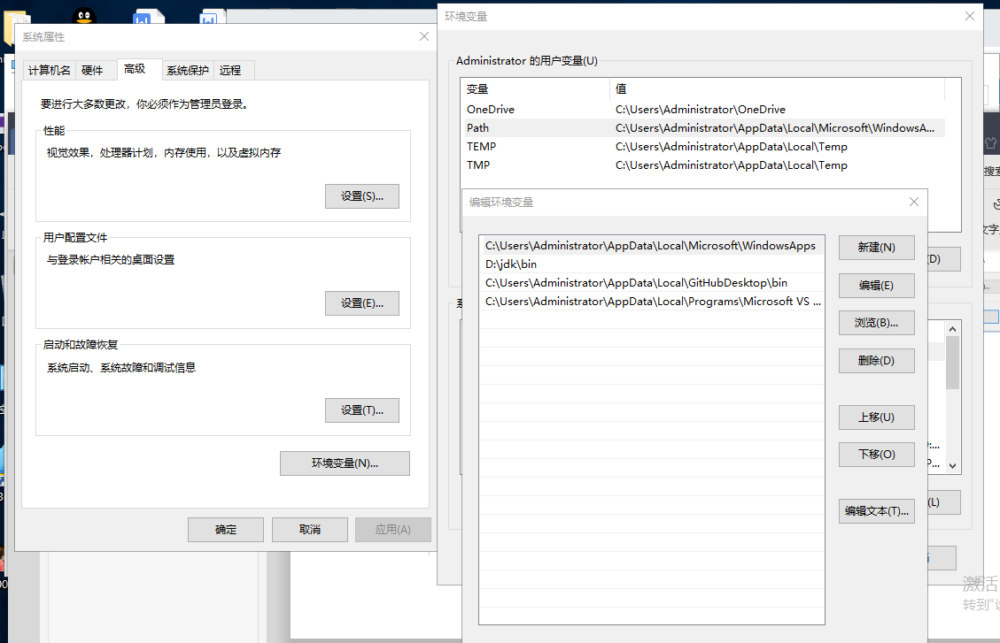
   确定后，并重启以使得环境变量生效.  
4、在vs 2019中新建项目
选择路径“File->New->Project”：  
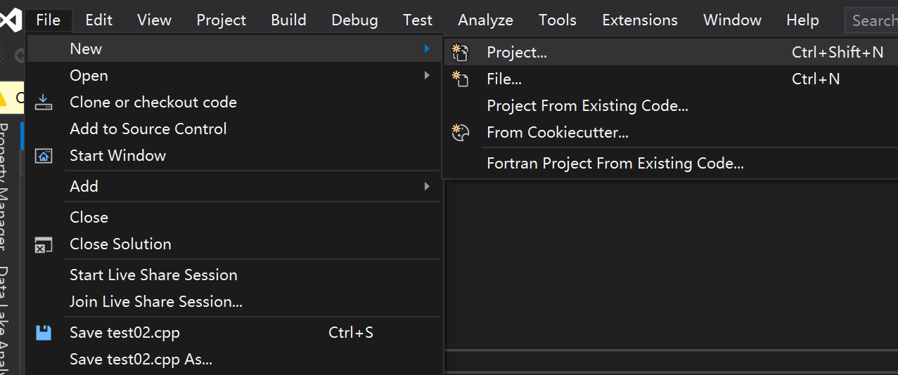  
依次选择Language为C++，Platform为Windows，Project type为desktop,  
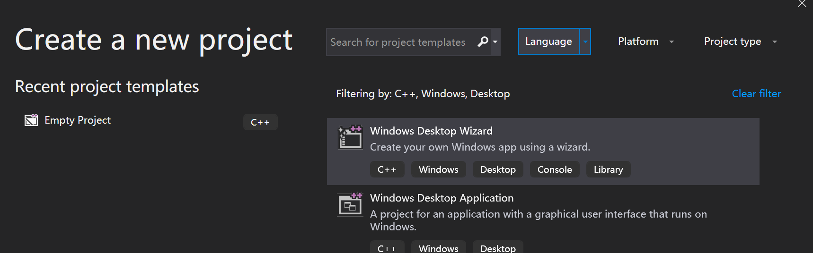  
选择Windows Desktop Wizard，并选择Next,  
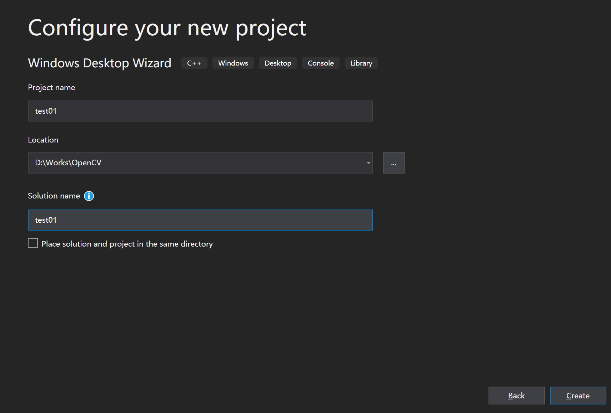  
点击Create,并下弹出的对话框中选择，Application type 为Console, 选择Empty Project,  
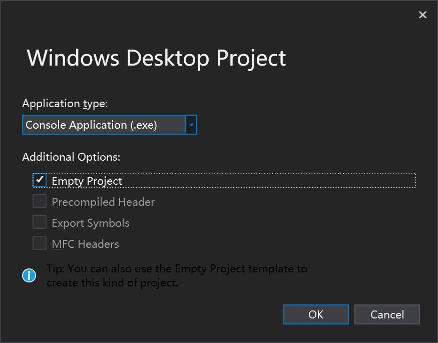  
点击OK，在Source files里面右键，添加New item:  
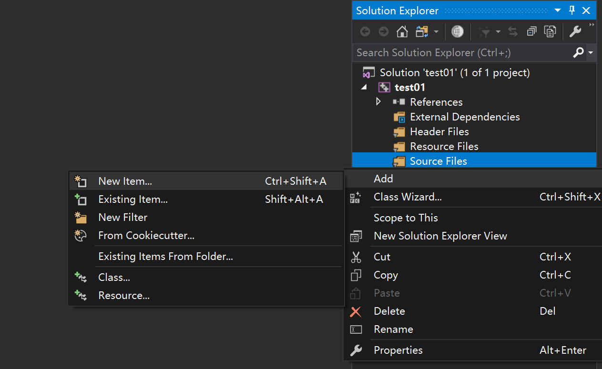  

添加test01.cpp源文件。  
右键test01这个Project,选择Properties:  
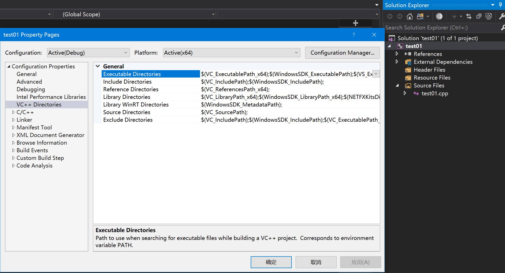  
选择VC++ Directories，在Include Directories中，  
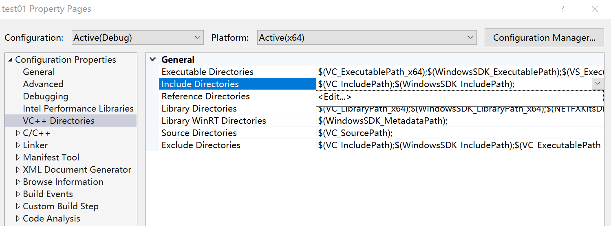  
添加C:\Programs\OpenCV\opencv411\build\include和C:\Programs\OpenCV\opencv411\build\include\opencv2这两个目录。  
  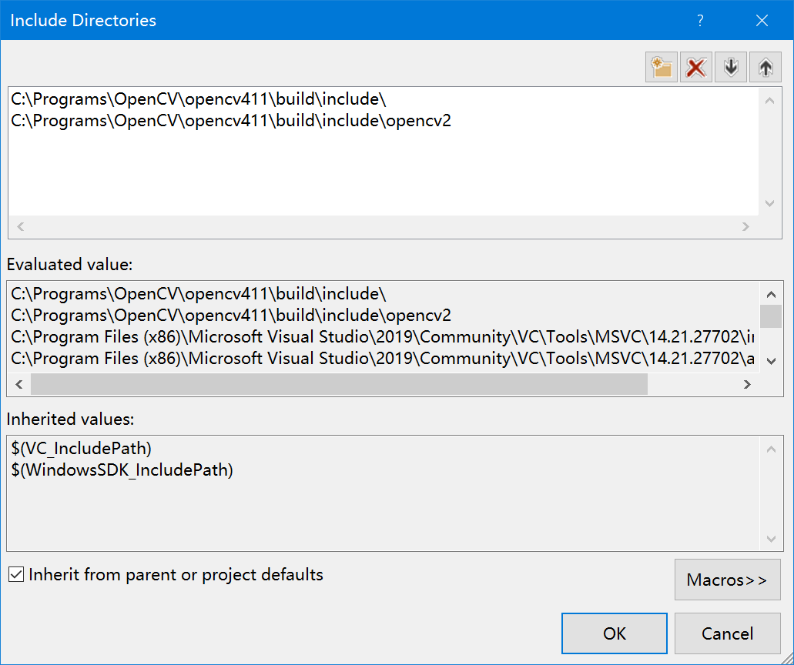  
  在Library Directories中添加C:\Programs\OpenCV\opencv411\build\x64\vc15\lib：  
  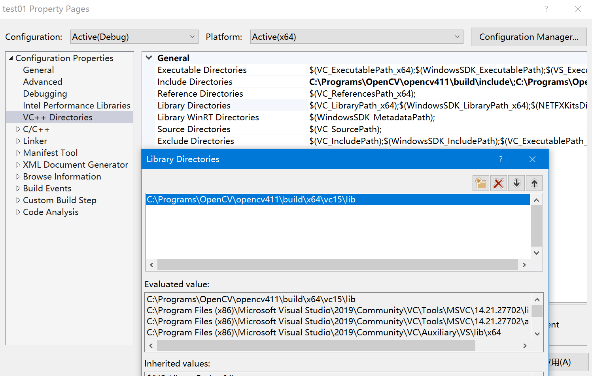  
  在Linker->Input目录下，点击Additional Dependencies并添加opencv_world411d.lib静态库：  
       
点击OK并确定退出。  
5测试代码

 
6下载visual studio code

下载链接<https://code.visualstudio.com>  
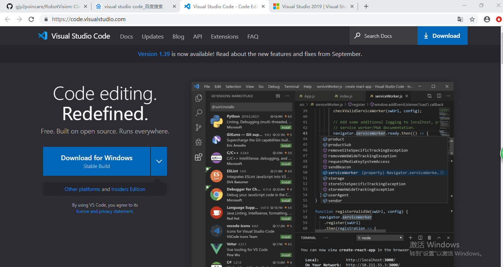  
7总结  
这次在老师的指导下安装opencv并配置环境，学会了一个新软件的应用，同时老师给我们讲解了一些关于计算机视觉，环境感知的知识，接触了一些新的知识，了解了计算机视觉的基本原理，还有opencv的实际应用等
