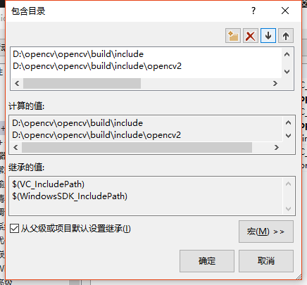
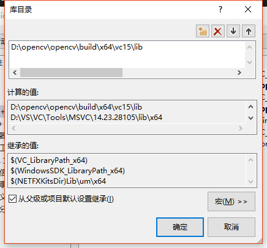
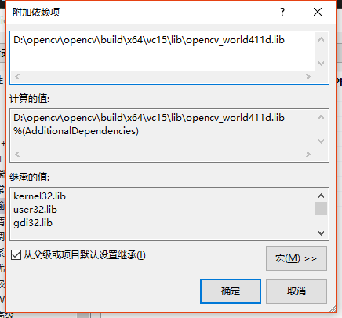
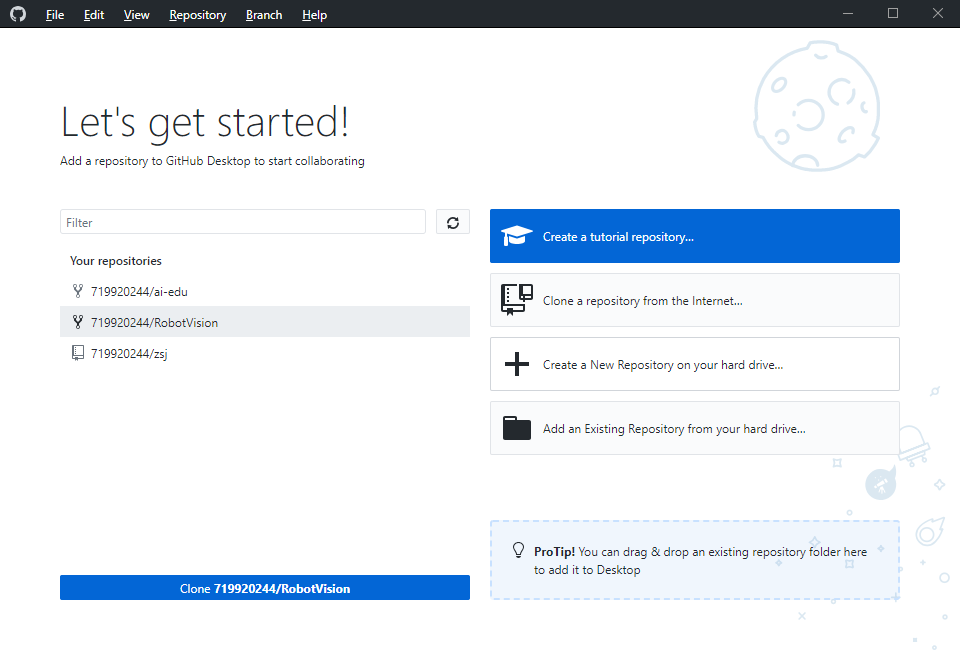

# 学习总结 

1. 今天的主要的任务是安装opencv和配置opencv的环境，安装VS2019

2. 在官网下载opencv并且安装，下载VS2019并且安装

4.其中关于opencv环境的配置要注意的是

5.在VC++目录的包含目录里面要添加D:\opencv\opencv\build\include
和D:\opencv\opencv\build\include\opencv2 

6.在库目录里面要添加D:\opencv\opencv\build\x64\vc15\lib

7.在链接器输入要添加D:\opencv\opencv\build\x64\vc15\lib\opencv_world411d.lib

这样才能保证环境配置成功

8.运行老师所给的测试代码能够正常显示图片表明opencv环境配置成功了

