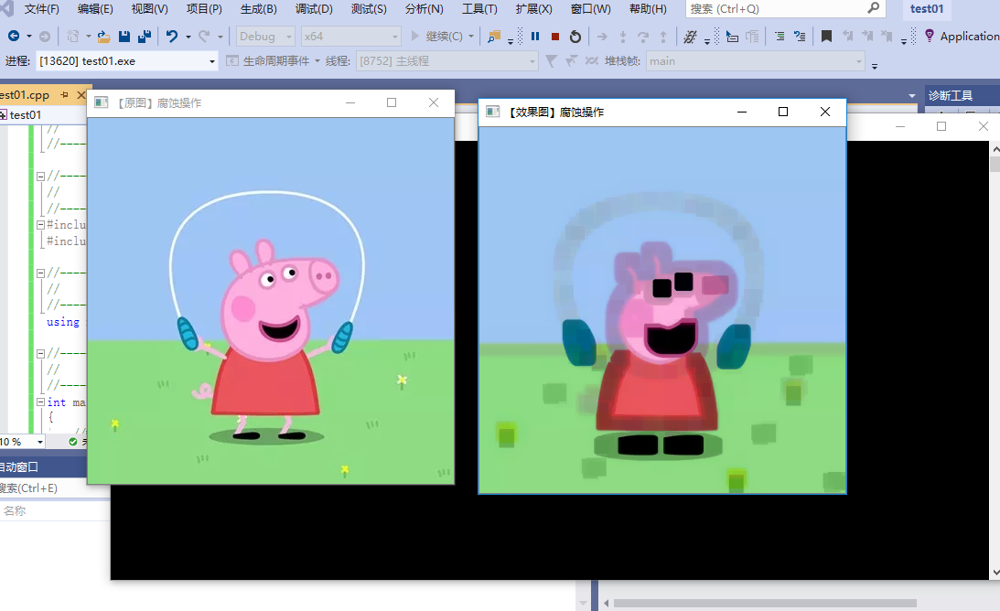
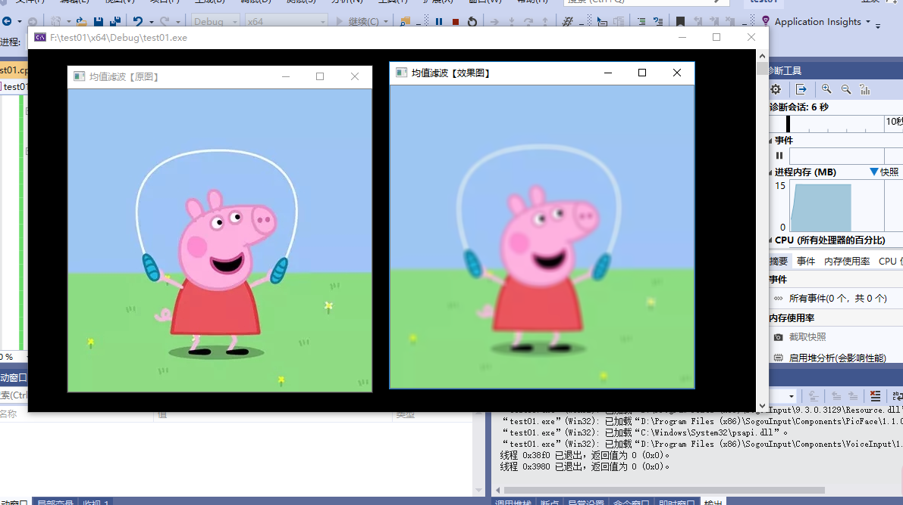
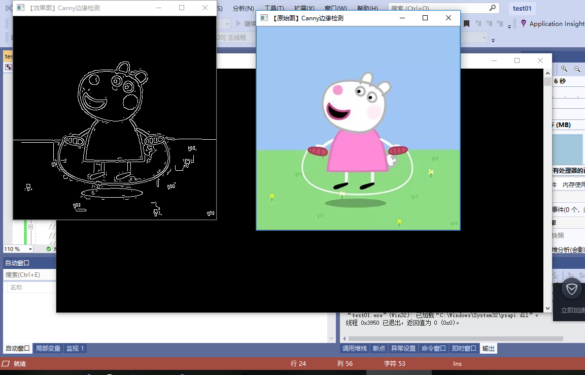

# 第二次作业
本次课学习如何快速上手OPenCV图像处理和github的使用方法
## 一.OpenCV图像处理
### 1.图像显示
代码中要用到几个函数。Mat类是在矩阵中存储图片的数据结构，它声明在 “opencv2/opencv.hpp”头文件中。waitKey()函数是一个键盘绑定函数（相当于让程序在这里挂起暂停执行），他接受一个单位为毫秒的时间，它等待指定时间的键盘事件，在指定时间内发生了键盘事件，程序继续执行，否则必须等到时间结束才能继续执行，参数如果为0表示等待无限长的事件。imread()是声明在 “opencv2/opencv.hpp”的函数，它从文件加载一个图片并存储在Mat数据结构中。imshow这个函数在指定名字的窗口中显示存储在mat中的图像。如果窗口使用WINDOW_AUTOSIZE创建的，图像会显示为它的原始尺寸，否则图像会调整到窗口的尺寸大小。

需要imread函数载入到新版本的图像存储数据结构Mat类中，然后用inshow函数显示。打开VS2019，新建一个项目，并在源文件中添加个cpp文件，在其中添加代码，代码添加成功后进行调试。

调试结果

### 2.图像腐蚀
腐蚀即用图像中的暗色部分“腐蚀”掉图片中的高亮部分。腐蚀是图像形态学比较常见的处理，腐蚀一般可以用来消除噪点，分割出独立的图像元素等。

程序首先是载入imread（）和显示imshow（），然后定义一个Mat类型的变量来获得getStructuringElement函数的返回值，而getStructuringElement函数的返回值为指定形状和尺寸的结构元素。参数准备完毕，调用erode函数进行图像腐蚀，使用像素邻域内的局部极小运算符来腐蚀一张图片，从src输入，由dst输出。使用erode函数，一般我们只需要填前面的三个参数，后面的四个参数都有默认值。而且往往结合getStructuringElement一起使用。最后调用imshow函数显示，并用waitKey函数等待按键。

打开VS2019，新建一个项目，并在源文件中添加个cpp文件，在其中添加代码，代码添加成功后进行调试。

调试结果

### 3.图像模糊
模糊操作时图像处理中最简单和常用的操作之一，使用该操作的原因之一就为了给图像预处理时减低噪声。 
使用模糊操作的背后是数学的卷积计算： 
![]（14.png)

均值滤波（归一化滤波）
均值滤波是典型的线性滤波算法，它是指在图像上对目标像素给一个模板，该模板包括了其周围的临近像素(以目标像素为中心的周围8个像素，构成一个滤波模板，即去掉目标像素本身)，再用模板中的全体像素的平均值来代替原来像素值。 

本次调试主要使用进行均值滤波操作的blur函数。将代码载入，并调试。

调试结果

### 4.canny边缘检测
Canny 是一种 multi-stage 算法，分别如下：
1.应用高斯滤波来平滑图像，去除噪声

2.找寻图像的强度梯度(intensity gradients)

3.应用非最大抑制(non-maximum suppression)技术来消除边缘误检(本来不是但检测出来是)

4.应用双阈值的方法来决定可能的(潜在)边界

5.利用滞后技术来跟踪边界

此次实验，要载入图象，并将其转成灰度图，再用blur函数进行图像模糊以降噪，最后用cannny函数进行边缘检测，最后显示出来。

将代码载入，并调试。

调试结果

## 二.github的使用方法
### 1.注册账户以及创建仓库
 使用github第一步是注册github账号。之后就可以创建仓库了（免费用户只能建公共仓库），Create a New Repository，填好名称后Create，之后会出现一些仓库的配置信息。
### 2.简单的配置
注册完毕登陆成功之后。选择settings进行基本资料的一些设置。
### 3.下载客户端
下载完之后，将在网页上克隆的文件，加入到自己的客户端中，并学习.
## 总结
此次学习openCV的图片显示，图片腐蚀，图片模糊，canny的边缘检测这四个内容，这些对新手来说，容易上手，能够快速掌握openCV的一些基本知识，也能基本了解opencv的使用。其中图像腐蚀，是形态学的基本处理，可以用来消除噪点，形态学还有膨胀处理。图像模糊用到blur函数，它是用均值滤波来实现的，blur函数的作用是对输入的图像均值滤波后用dst输出，均值滤波即方框滤波归一化特例，就是用邻域内像素均值来代替该点像素值，均值滤波在去噪的同时也破坏了图像细节部分函数原型。canny边缘检测用高斯滤波来平滑图像，去除噪声的。此次只是简单的上手学习opencv的基本操作，让我们更加熟悉opencv的有关操作。还有这次课也学习了github的使用方法，并学会克隆保存别人的学习资料，还会创建自己的仓库。，本次学习，收获很多，让我更加了解opencv的魅力，还有个i太湖边这个学习平台。
