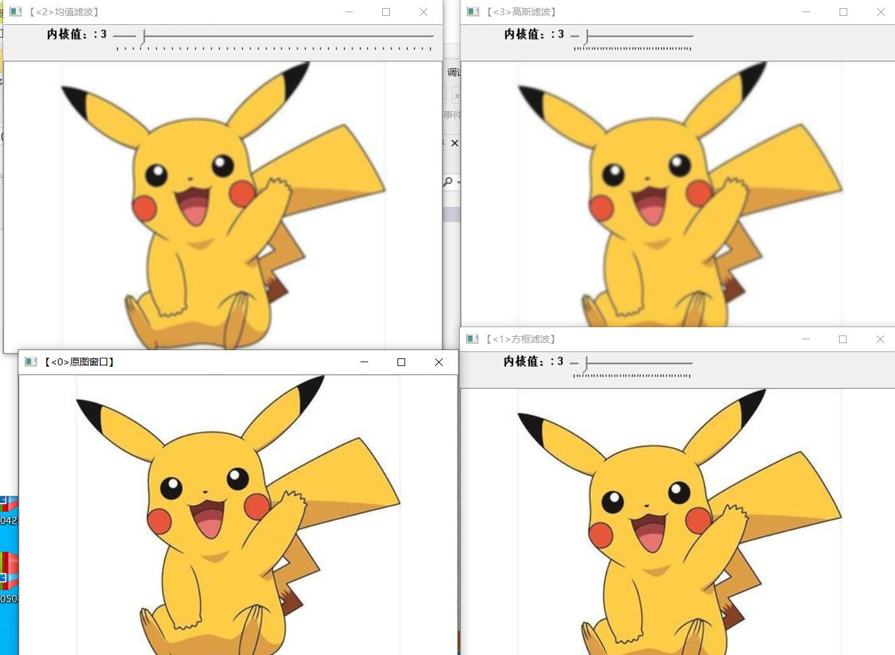

# 第三次作业
这次上课主要讲了线性滤波器，
线性滤波器分为低通滤波器，高通滤波器，带通滤波器，带阻滤波器，全通滤波器，陷波滤波器。
1（）我们运用的是方框滤波，均值滤波，高斯滤波。
1.首先是方框滤波（box Filter）方框滤波（box Filter）被封装在一个名为boxblur的函数中，
即boxblur函数的作用是使用方框滤波器（box filter）来模糊一张图片，从src输入，从dst输出。
2.均值滤波
均值滤波是典型的线性滤波算法，主要方法为邻域平均法，
即用一片图像区域的各个像素的均值来代替原图像中的各个像素值。
3.高斯滤波
高斯滤波是一种线性平滑滤波，适用于消除高斯噪声，广泛应用于图像处理的减噪过程。通俗的讲，
高斯滤波就是对整幅图像进行加权平均的过程，
每一个像素点的值，都由其本身和邻域内的其他像素值经过加权平均后得到。
以下是图例
